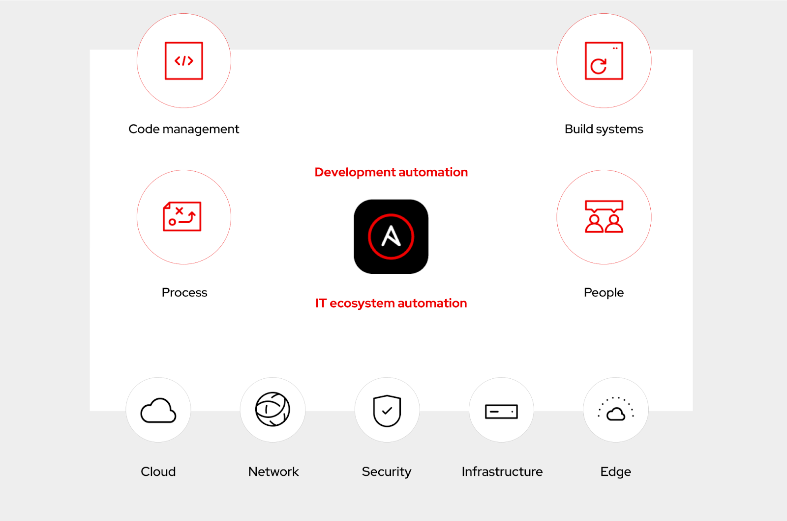

# Blog - DevOps and CI/CD with automation controller

## Overview

In this blog, we demonstrate how to use automation controller in a typical DevOps workflow to deploy and update a website.

### Published blog

[DevOps and CI/CD with automation controller](https://www.ansible.com/blog/devops-and-ci/cd-with-automation-controller)

### Try the self-paced lab

Please feel free to try the [DevOps and CI/CD with automation controller](https://play.instruqt.com/embed/redhat/tracks/devops-controller?token=em_CThk70fjjSxb1wnt&show_challenges=true) self-paced lab.

## Content

- [Controller Job Template Playbooks](./examples/controller/playbooks/)
- [Gitea configuration](./examples/gitea/)
- [Jenkins configuration](./examples/jenkins/)
