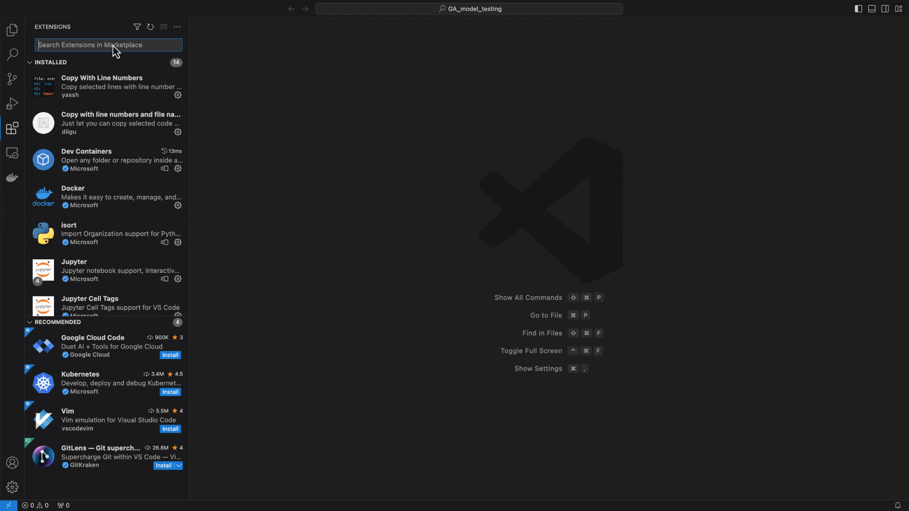
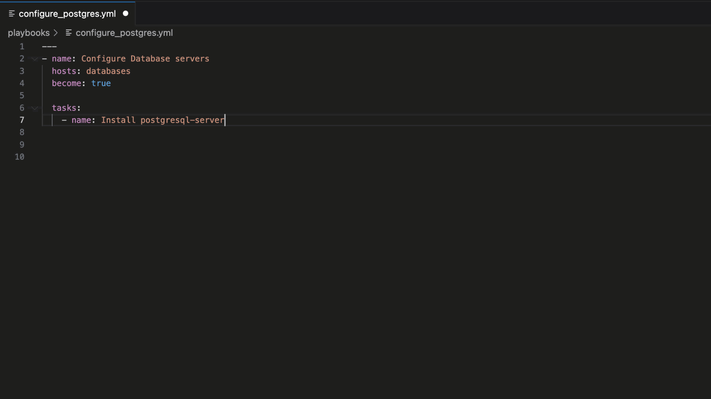
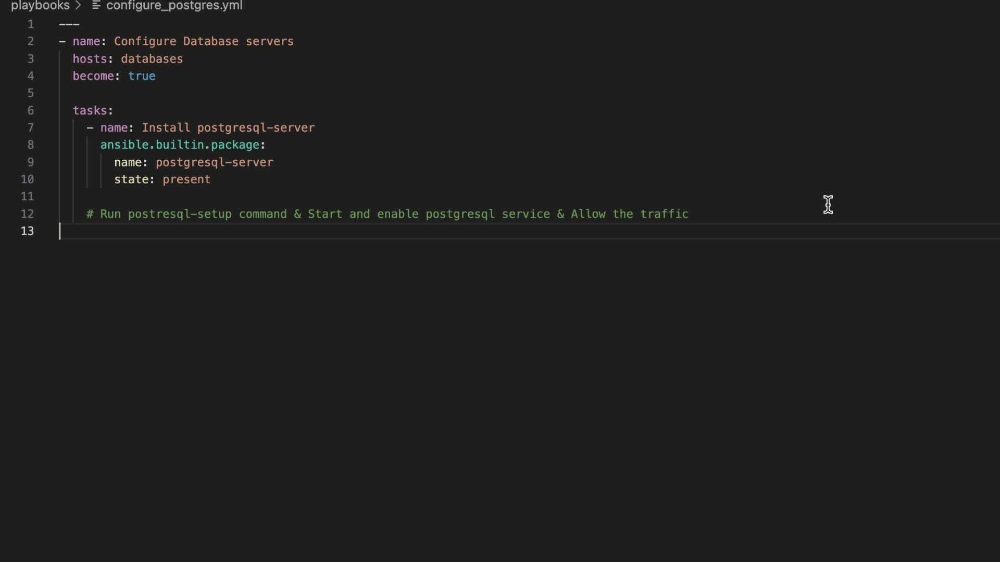

# Welcome to the Ansible Lightspeed with IBM Watson Code Assistant GA blog

## Overview

## Blog example content

>ℹ️ **Note**
>
> Watson Code Assistant, the Large Language Model used to generate Ansible content suggestions, continues to learn and improve, and suggestions will differ as later versions of the model are released. The Ansible task suggestions generated in the blog will therefore differ from the time of publication.

#### Playbook files

#### Code Bot

