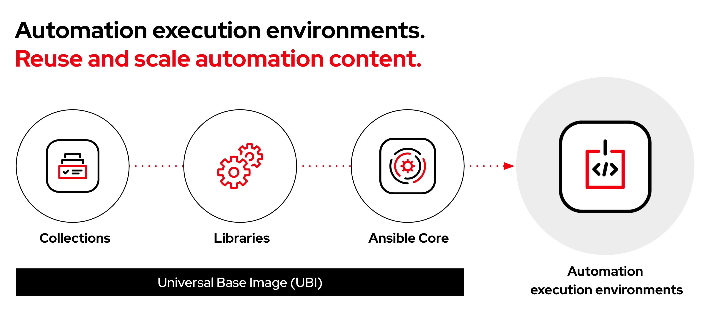
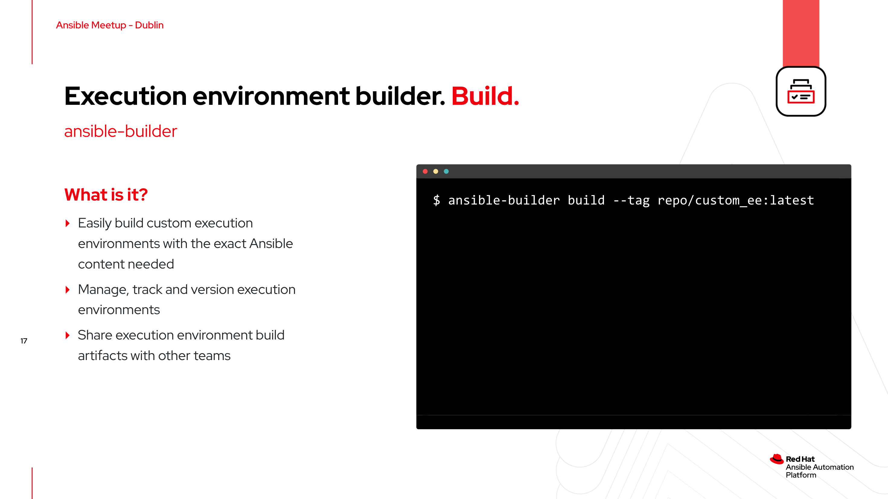
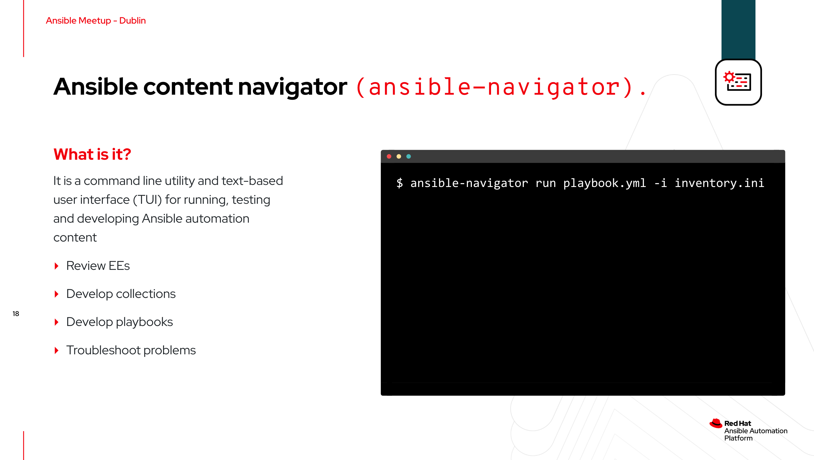

# Ansible Ireland Meetup - Dublin Feb 2023 - Ansible content creation with execution environments

## Overview

[**Slide deck**](../../assets/slides/dublin_meetup_feb2023_slides.pdf)



In the Feb 2023 [Ansible Ireland Meetup](https://www.meetup.com/ansible-ireland/), we discussed automation execution environments and the improved content creation tools.

Execution environments are containerised images containing ansible-core, Ansible content, such as Content Collections, and any additional, needed dependencies. Execution environments (EE) provide a reliable, consistent framework to build, test and deploy Ansible Automation at scale.

The improved Ansible content creation tools, including [ansible-builder](https://ansible-builder.readthedocs.io/en/stable/), [ansible-navigator](https://ansible-navigator.readthedocs.io/en/latest/), and the [Ansible Visual Studio Code extension](https://marketplace.visualstudio.com/items?itemName=redhat.ansible), simplify building and using Ansible execution environments with your automation.

>ℹ️ **Note**<p>
> The content below is examples only. Please review and change it accordingly to meet your requirements.

## Demonstration

### Step 1 - ansible-builder



>ℹ️ **Note**<p>
> Run all the commands from the `./dublin_meetup_feb2023/execution_environment` directory.

The [execution-environment.yml](./execution_environment/execution-environment.yml) and [requirements.yml](execution_environment/requirements.yml) files contain the configuration and required Ansible content collections needed to run the demo automation.

1. Use [ansible-builder](https://ansible-builder.readthedocs.io/en/stable/) to create the `dublin_meetup:latest` execution environment (EE).

```bash
dublin_meetup_feb2023/execution_environment$ ansible-builder build --tag quay.io/acme_corp/dublin_meetup:latest -v 3
```

2. Push the `dublin_meetup:latest` EE to the [quay.io](https://quay.io/) image repository.

```bash
dublin_meetup_feb2023/execution_environment$ podman push quay.io/acme_corp/dublin_meetup:latest
```

## Step 2 - ansible-navigator



>ℹ️ **Note**<p>
> Run all the commands from the `./dublin_meetup_feb2023` directory.   
> Modify the [manage_cloud.yml](manage_cloud.yml) playbook parameters to match your environment.

The [ansible-navigator.yml](ansible-navigator.yml) file contains the `ansible-navigator` demo configuration. These options can also be passed via the command line.

1. Use [ansible-navigator](https://ansible-navigator.readthedocs.io/en/latest/) to run the [manage_cloud.yml](manage_cloud.yml) playbook.

```bash
dublin_meetup_feb2023$ ansible-navigator run provision_cloud.yml
```
