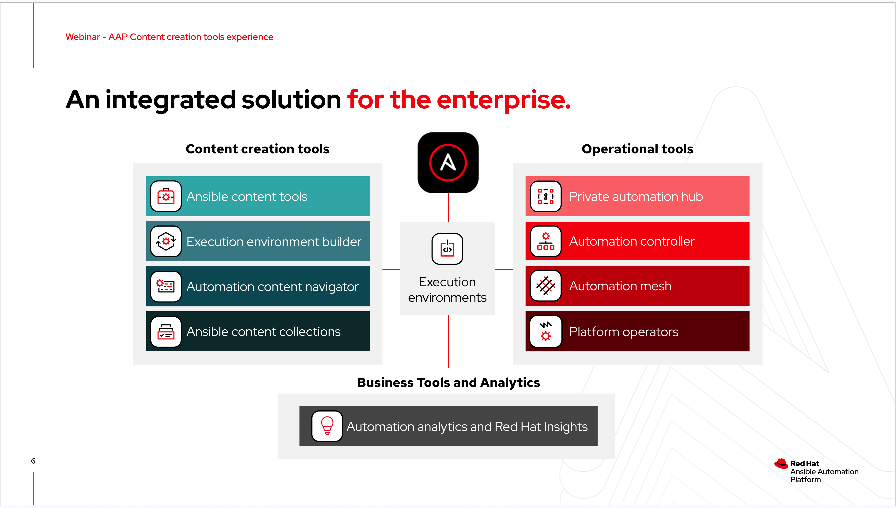
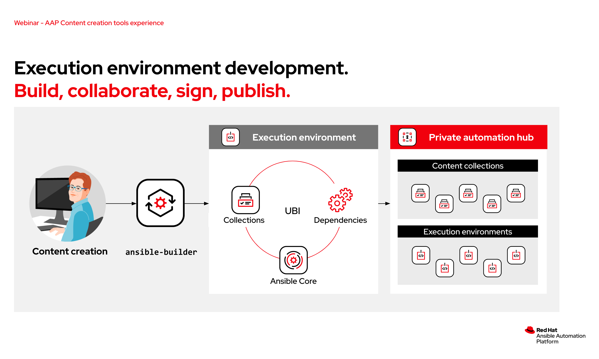
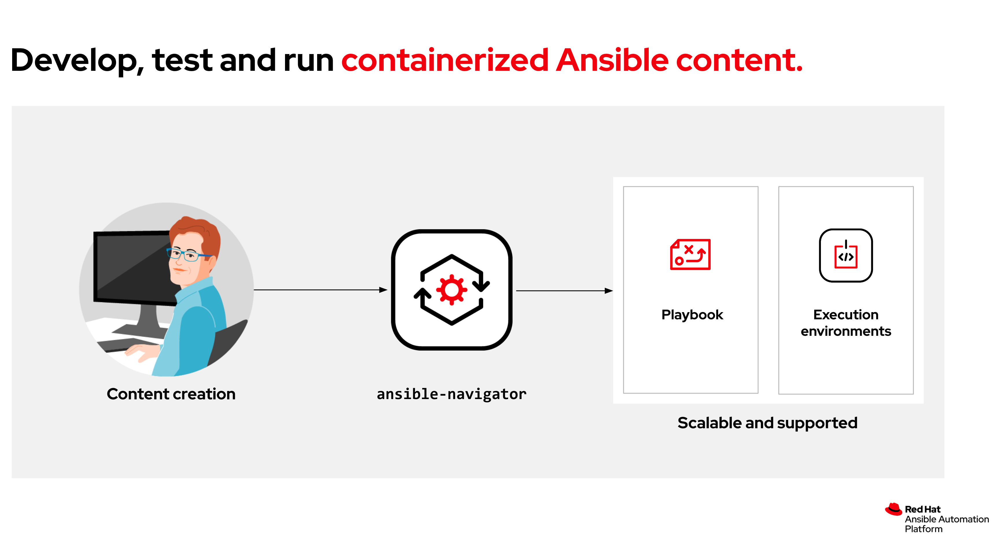
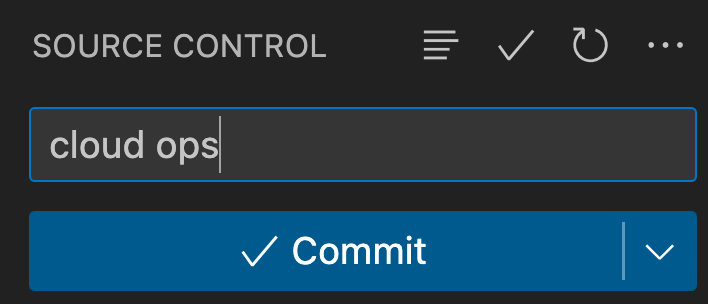
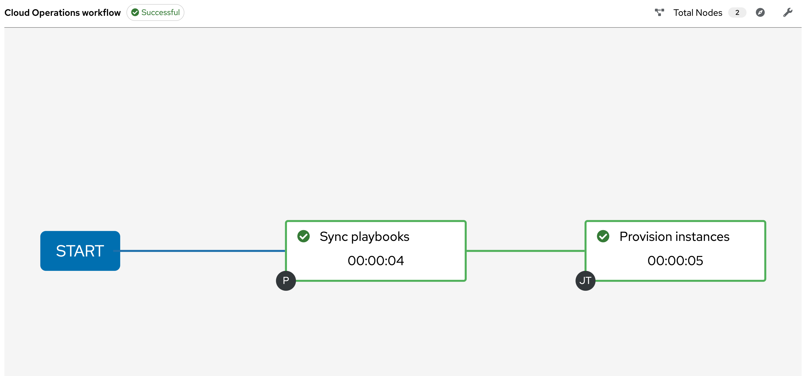

# EMEA Open Demos April 2023 - Ansible Automation Platform content creation tools webinar

## Overview

[**Slide deck**](../../assets/slides/content_creation_tools.pdf)



The [Build and deploy using Ansible content developer tools](https://events.redhat.com/profile/form/index.cfm?PKformID=0x758671cd6d&extIdCarryOver=true&sc_cid=7013a0000034gRCAAY#overview) webinar covered the Ansible Automation Platform content creation tools and it's role in developing and executing consistent automation.

Execution environments are containerised images containing ansible-core, Ansible content, such as Content Collections, and any additional dependencies. Execution environments (EE) provide a reliable, consistent framework to build, test and deploy Ansible Automation at scale.

The improved Ansible content creation tools, including [ansible-builder](https://ansible-builder.readthedocs.io/en/stable/), [ansible-navigator](https://ansible-navigator.readthedocs.io/en/latest/), and the [Ansible Visual Studio Code extension](https://marketplace.visualstudio.com/items?itemName=redhat.ansible), simplify building and using Ansible execution environments with your automation.

>ℹ️ **Note**<p>
> The content below is examples only. Please review and change it accordingly to meet your requirements.

## Demonstration

### Step 1 - `ansible-builder`



>ℹ️ **Note**<p>
> Run all the commands from the `./webinar_content_tools_apr2023/execution_environment` directory.

The [execution-environment.yml](./execution_environment/execution-environment.yml) and [requirements.yml](execution_environment/requirements.yml) files contain the configuration and required Ansible content collections needed to run the demo automation.

1. Use [ansible-builder](https://ansible-builder.readthedocs.io/en/stable/) to create the `content_tools_demo_ee:latest` execution environment (EE).

```bash
webinar_content_tools_apr2023/execution_environment$ ansible-builder build --tag quay.io/acme_corp/content_tools_demo_ee -v 3
```

2. Push the `content_tools_demo_ee:latest` EE to the [quay.io](https://quay.io/) image repository.

```bash
webinar_content_tools_apr2023/execution_environment$ podman push quay.io/acme_corp/content_tools_demo_ee
```

## Step 2 - `ansible-navigator`



>ℹ️ **Note**<p>
> Run all the commands from the `./webinar_content_tools_apr2023` directory.
> Modify the [manage_cloud.yml](manage_cloud.yml) playbook parameters to match your environment.

The [ansible-navigator.yml](ansible-navigator.yml) file contains the `ansible-navigator` demo configuration. These options can also be passed via the command line.

1. Use [ansible-navigator](https://ansible-navigator.readthedocs.io/en/latest/) to run the [manage_cloud.yml](manage_cloud.yml) playbook.

```bash
webinar_content_tools_apr2023$ ansible-navigator run manage_cloud.yml
```

## Step 3 - Ansible and VS Code

1. Push the [manage_cloud.yml](manage_cloud.yml) to your source code repository.


## Step 4 - Automation controller



Use [automation controller](https://www.ansible.com/products/controller) to create the following:
1. A *Project* pointing to your source code repository. The demo used [https://github.com/craig-br/demos](https://github.com/craig-br/demos).
2. An execution environment definition for `quay.io/acme_corp/content_tools_demo_ee`.
3. A *Job Template* using [manage_cloud.yml](manage_cloud.yml), the `content_tools_demo_ee` execution environment, and any additional requirments such as AWS credentials.
4. Create a *Workflow* that first performs a *Project* sync and then executes the *Job Template*.
5. Run the *Workflow* and profit.
