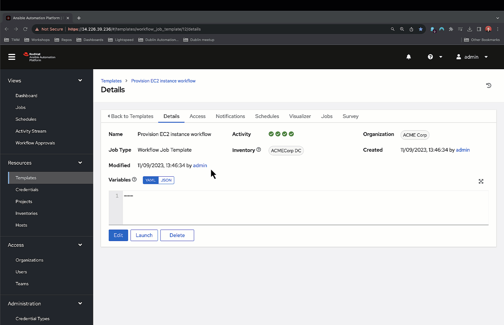

# Dublin Automation Day September 2023

## Event Overview

[**Session slide deck**](../../assets/slides/dublin_automation_day_sep_2023.pdf)

The Ansible Automation Day Dublin, held on 14 September 2023, covered new, exciting features available in Ansible Automation Platform, customer-focussed discussions, and our strategy moving forward.

The event included a discussion and demonstration of the technical preview version of [Ansible Lightspeed with watsonx Code Assiatant](https://www.redhat.com/en/engage/ansible-lightspeed).

## Demonstration overview

In the demonstration, we used Ansible Lightspeed to generate Ansible tasks to provision an AWS EC2 instance, and used an automation controller workflow to run the generated tasks.

## Ansible Lightspeed Demonstration steps

### Step 1

#### Uncomment and generate task `# - name: Gather subnet info tag:Name subnet-lightspeed`

- Used natural language prompt to generate syntactically correct Ansible Playbook Task.
- Suggestion incorporated Ansible best practices and used Fully Qualified Collection Name (FQCN).
- Ansible Lightspeed used the Playbook name "EC2 Cloud Operations" to use the correct "amazon.aws.ec2_vpc_subnet_info" module.

### Step 2

#### Uncomment and generate task `Create vpc_subnet_id var`

- Used the Playbook context to use AWS Ansible modules in the suggestion.
- Used natural language to generate the `vpc_subnet_id` variable using the correct variable keys.
- The suggestion provides the correct key value from the previously task's registered variable.

### Step 3

#### Uncomment and generate task `- name: Gather subnet info tag:Name subnet-lightspeed`

- Used `tag:Name subnet-lightspeed` in the prompt to use the correct AWS filter.

### Step 4

#### Uncomment and generate task `- name: Create vpc_subnet_id var`

- Used `tag:Name subnet-lightspeed` in the prompt to use the correct AWS filter.

### Step 5

#### Uncomment and generate task `- name: Provision t3.micro instance`

- Suggestion provides good variable examples for module arguments.

### Step 6

#### Uncomment the `vars` section at the top of the Playbook and remove the previous task

#### Generate a new, updated  task with  `- name: Provision t3.micro instance using ec2_instance var`

- Ansible Lightspeed used the updated natural language prompt and referenced the `ec2_instance` variable in the suggestion.

### Automation controller workflow

---
