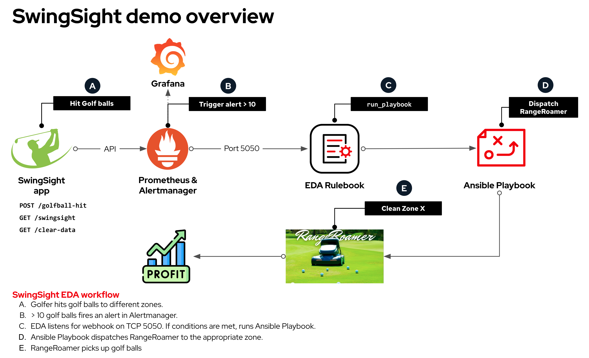

# Ansible Ireland Meetup Sep 2023 - Event-Driven Ansible SwingSight Demo

## Overview

[**Slide deck**](../../assets/slides//dublin_automation_day_sep_2023.pdf)  
[**SwingSight metrics repo**](https://github.com/cloin/swingsight_metrics)

In the September 2023 [Ansible Ireland Meetup](https://www.meetup.com/ansible-ireland/), we discussed [Event-Driven Ansible](https://www.redhat.com/en/technologies/management/ansible/event-driven-ansible) (EDA) and demonstrated how it can extend your automation to Day 2 operations by observing events in your environment, evaluating conditions, and acting using your predefined Ansible content.

## Demonstration



### Setting up the demo

Follow the instructions available at the [SwingSight metrics repo](https://github.com/cloin/swingsight_metrics).

### EDA Rulebook example

```yaml
---
- name: Capture alertmanager alerts
  hosts: localhost
  sources:
    - ansible.eda.alertmanager:
        host: 0.0.0.0
        port: 5050
        data_alerts_path: alerts
        data_host_path:
        data_path_separator: .
        skip_original_data: true
      filters:
        - cloin.eda.poster:
            webhook_url:

  rules:

    - name: Dispatch RangeRoamer
      condition: |
        event.alert.labels.alertname == "Golf ball alert" and
        event.alert.labels.job == "swingsight_app" and
        event.alert.status == "firing"
      action:
        run_playbook:
          name: /playbooks/am_dispatch_rangeroamer.yml

    - name: RangeRoamer completed
      condition: |
        event.alert.labels.alertname == "Golf ball alert" and
        event.alert.labels.job == "swingsight_app" and
        event.alert.status == "resolved"
      action:
        debug:
```

### Ansible Playbook example

```yaml
---
- name: Dispatch RangeRoamer
  hosts: localhost
  connection: local
  gather_facts: false

  tasks:

    - name: Fetch zone metrics
      cloin.prometheus.query:
        prometheus_url: 'http://prometheus:9090'
        queries:
          - 'count_zone_1'
          - 'count_zone_2'
          - 'count_zone_3'
      register: metrics

    - name: Debug collected metrics
      ansible.builtin.debug:
        var: metrics

    - name: Get zone with most balls
      ansible.builtin.set_fact:
        highest_metric: "{{ metrics.metrics_data | dictsort(by='value') | last }}"

    - name: Extract zone ID from the highest metric
      ansible.builtin.set_fact:
        zone_match: "{{ highest_metric | regex_search('zone_(\\d+)') }}"

    - name: Dispatch RangeRoamer
      ansible.builtin.debug:
        msg: "Dispatching RangeRoamer to {{ zone_match }}"
      when: zone_match is not none

    - name: Finish sweep
      ansible.builtin.uri:
        method: GET
        url: http://swingsight:5050/clear-data
```

## Video


---
