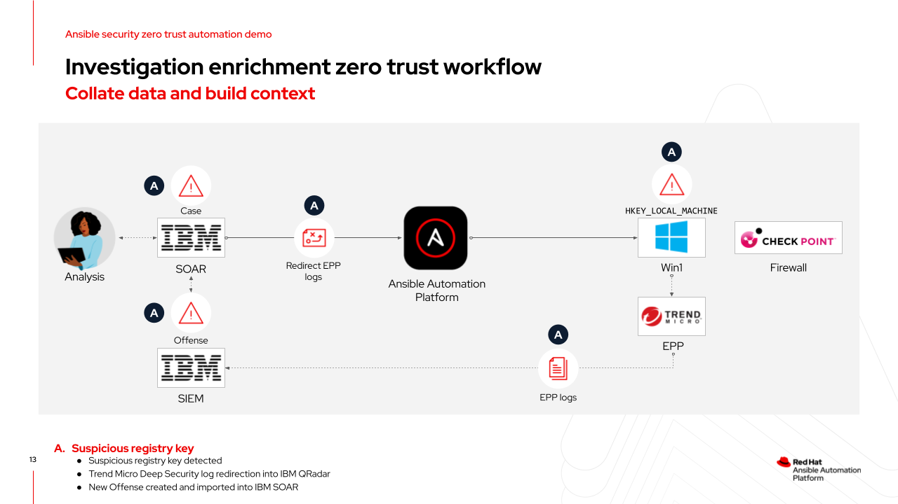
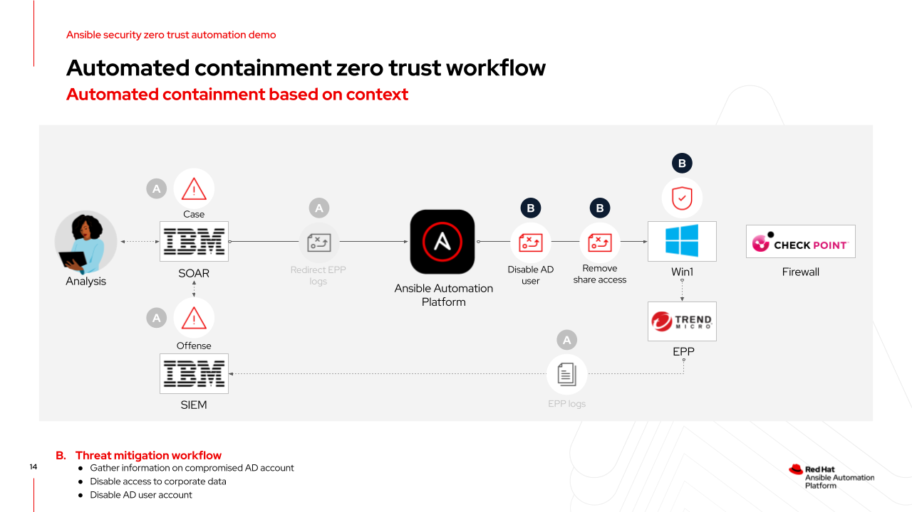

# Ansible security automation - Security response and remediation Zero Trust demo

## Overview

[**Slide deck**](../../assets/slides/zta_demo_slides.pdf)

According to the Cyber Resilient Organization Study 2021, 66% of surveyed leaders recognize that automation, machine learning, AI and orchestration strengthen cyber resiliency.

This demo illustrates how Ansible security automation can be used to contain and isolate a a potential cyber-attack and automate remediation tasks.

This demo content was used in the [Automating security response and remediation with Ansible Automation Platform](https://events.redhat.com/profile/form/index.cfm?PKformID=0x659092cacd) webinar.

Feel free to watch the webinar and use the [playbook examples](playbooks) to inspire your own automation content.

>*Note*

> The playbooks are examples only and don't provision the instances or systems used in the demonstration.

## Demonstration

### Step 1

- Suspicious registry key is detected on `Win1` host
- TrendMicro DeepSecurity generates a log in IBM QRadar SIEM.
- Analyst imports IBM QRadar SIEM Offense into IBM QRadar SOAR

## Step 2

- Analyst triggers [`contain_and_isolate.yml`](playbooks/contain_and_isolate.yml) playbook in automation controller using IBM SOAR.
- Ansible Automation Platform automates removing domain user from corporate shares and disables the compromised user account.

## Step 3

- Analyst redirects Check Point NGFW logs into QRadar SIEM using [cp_redirect_logs.yml](playbooks/cp_redirect_logs.yml) in automation controller.
- Analyst determines the traffic is malicious and remediates by updating the Check Point NGFW firewall policy using [cp_deny_traffic.yml](playbooks/cp_deny_traffic.yml).

## Content Collections

The demo uses the following Ansible content collections:

- ansible.windows
- community.windows
- trendmicro.deepsec
- check_point.mgmt
